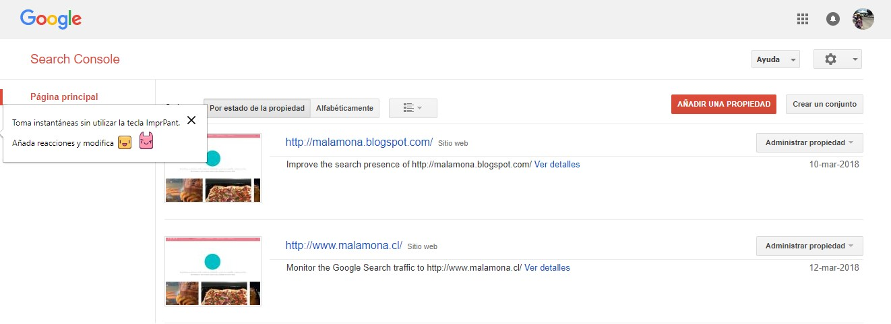
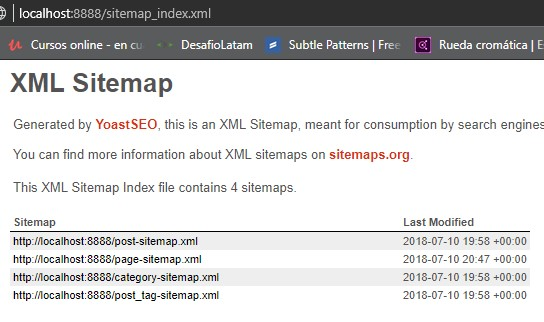

# Deploy, SEO, y seguridad - Wordpress

## Deploy y seguridad en página empresa Kleaner

- URL del sitio web en producción

- Screenshot de la integración de Google Search Console con el sitio web

- URL del sitemap creado

- Listado con los aspectos de seguridad que optimizaste dentro de la página web

* WP actualizado 
* claves y permisos otorgados solo al admin del sitio 
* servidores y hosting ok, por que es local
* wordfence instalado

